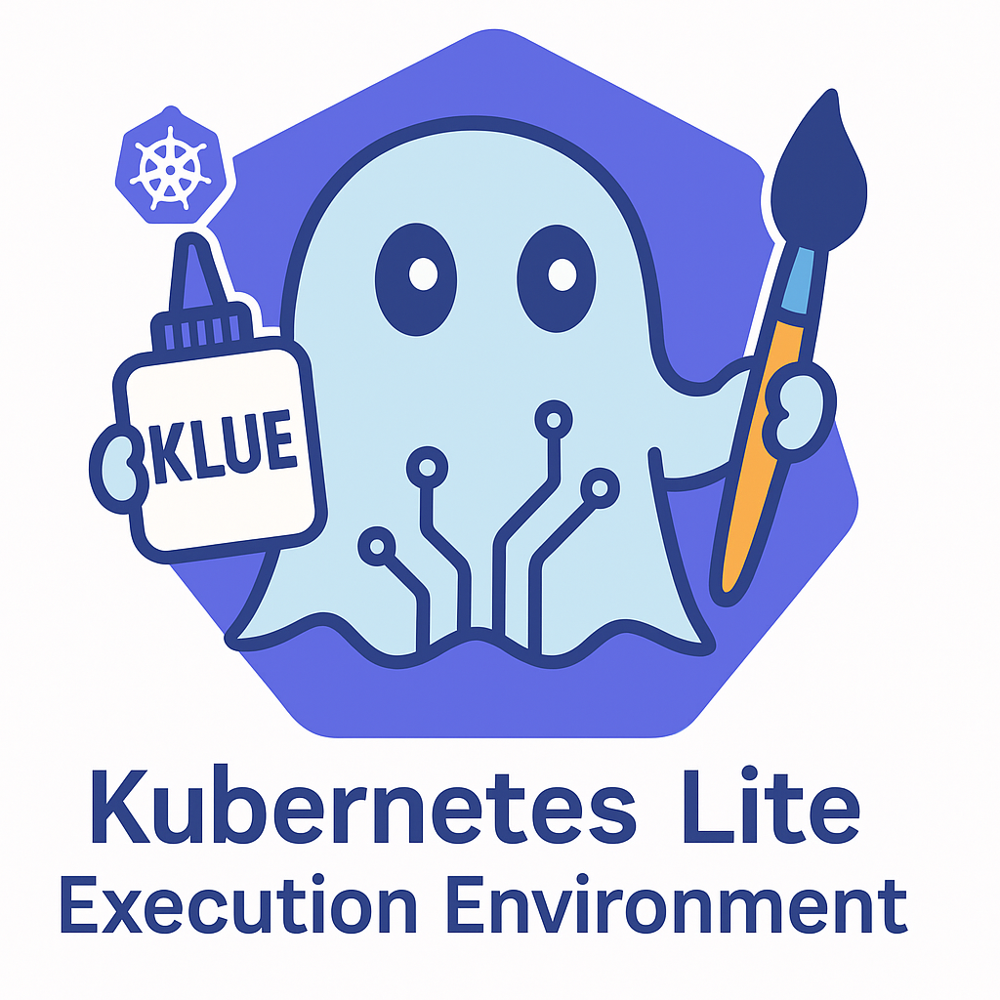
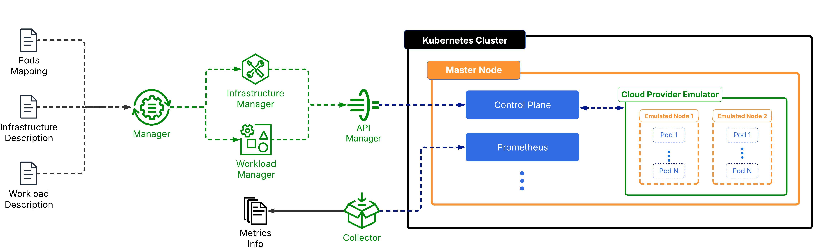

# 🚀 KLUE – `K`ubernetes `L`ite exec`U`tion `E`nvironment



KLUE is a **emulation tool** that allows developers to **test and validate cloud infrastructure changes** without incurring unnecessary expenses.

It enables seamless **Kubernetes** experimentation, helping teams optimize configurations, improve scalability, and reduce cloud costs.

## 🧩 The KLUE Architecture


---
## 🛠 Installation Guide
Execute our emulation tool is a very simple process, but it requires a configured cluster (or the informations to create it automatically). To help you with that, we created some scripts that will help you to install the dependencies and create a cluster, if you want to. If else, just install the dependencies and run the emulation tool passing the cluster context as an argument (you will see more about this on [▶️ Running the KLUE](#-running-the-klue)).

**Note:** We strongly recommend using a Minikube or EKS cluster, but you can also use any other Kubernetes cluster, once you have installed the dependencies to run an emulation.

### 📌 Installing Dependencies
To install the required dependencies for an Minikube or EKS cluster (don't worry about how to create one of these kind of clusters for now), run the following command:
```bash
chmod +x install-dependencies.sh
./install-dependencies.sh
```

### 📌 Creating an Cluster
To create your cluster, and start your journey with our emulation tool, you just need to run:
```bash
chmod +x create-cluster.sh
./create-cluster.sh
```

**IMPORTANT!!!:** Read [this guide](https://github.com/ufcg-lsd/klue/tree/main/docs/#eks) if you want to use an EKS cluster, you should setup some environment variables before running the script.

---
## 📂 About the Emulation Input
Follow [this guide](https://github.com/ufcg-lsd/klue/tree/main/docs/#INPUT) to learn how to prepare the input for KLUE. The input can be a trace collected from a real cluster or a trace you generate yourself, as long as it follows the format defined in our tool's documentation.

## 🚀 Executing the Emulation Tool

### 🔑 Grant Execution Permission
Before running an emulation, grant execution permission to the **execute_emulation.sh** file by running:

```bash
chmod +x execute-emulation.sh
```
### ▶️ Running the KLUE

Our emulation tool supports **8 different execution modes** by combining the available flags. Below are the main ways to run the tool, with examples for each scenario. You can combine the flags as needed to fit your use case.

#### 0. **Before Start**
Now that you have decided the kind of cluster you want to use and created it, you can use an existing cluster independing of the kind (EKS, minikube or another).

**OBS:** you can get the cluster context by running `kubectl config current-context`.

#### 1. **Basic Emulation with Existing Cluster**
Use an existing cluster and provide a trace file, it will start an emulation without Karpenter, dynamic infrastructure and workload, and consideer that you don't have and input in the KLUE format:
```bash
./execute_emulation.sh --sim --use-cluster <cluster-context> --data-path <trace-path>
```

#### 2. **Enable Karpenter (Dynamic Node Management)**
If you want to use Karpenter for dynamic node management, you need to provide the path to the nodepool file:
```bash
./execute_emulation.sh --sim --use-cluster <cluster-context> --data-path <trace-path> --use-karpenter --nodepool-path <nodepool-path>
```

#### 3. **Skip Tracer Step**
Like we said before in [this guide](https://github.com/ufcg-lsd/klue/tree/main/docs/#INPUT), you can execute our emulation tool in a lot of scenarious. One of them, is the one which you have one input in the format of our tool. 
Add `--skip-tracer` to any command to skip the trace generation step:
```bash
./execute_emulation.sh --sim --use-cluster <cluster-context> --data-path <trace-path> --skip-tracer
```

#### 5. **Static Infrastructure or Workload**
Use static infrastructure and/or workload:
```bash
./execute_emulation.sh --sim --use-cluster <cluster-context> --data-path <trace-path> --static-infra
./execute_emulation.sh --sim --use-cluster <cluster-context> --data-path <trace-path> --static-workload
./execute_emulation.sh --sim --use-cluster <cluster-context> --data-path <trace-path> --static-infra --static-workload
```

#### 6. **Playground (Development) Mode**
Set up a development environment (no emulation), it's just for test Karpenter actions manually:
```bash
./execute_emulation.sh --dev --use-cluster <cluster-context>
```
You can also combine with `--use-karpenter` if needed (it will install the karpenter in your cluster).

---

#### ℹ️ **Combining Flags**
You can combine the flags above to create up to 15 different execution modes, for example:
- Emulation with existing cluster, Karpenter, static infra, and skip tracer:
  ```bash
  ./execute_emulation.sh --sim --use-cluster --data-path <trace-path> --use-karpenter --nodepool-path <nodepool-path> --static-infra --skip-tracer
  ```
- Emulation with existing cluster, dynamic infra, and workload:
  ```bash
  ./execute_emulation.sh --sim --use-cluster <cluster-context> --data-path <trace-path>
  ```

#### 7. **Help**
To see all available options and combinations, run:
```bash
./execute_emulation.sh --help
```

> **Note:** Some flags require others (e.g., `--use-karpenter` requires `--nodepool-path`). If you provide invalid or missing combinations, the script will show an error message.

---

## 🧪 Testing
If you want to contribue with our project, we have some simple tests which ensure the correct functioning of the KLUE flow. It will help you to see if have inserted some bug in the code or if you have broken something. To run the tests, just run:
```bash
PYTHONPATH=./src pytest tests/test_klue_workflow.py
```

We have 8 test cases, each one cover the different execution modes of the emulation tool.

**OBS:** The tests may take a while to run, as they involve setting up a Kubernetes cluster and running the emulation tool multiple times. In average, it takes around 20 - 25 minutes to run all tests depending on your network connection.

---
## ⚠️ Important Precautions

When running the emulation multiple times on the same cluster, that are **three main steps** needed for guaranteeing that you will have a correct execution, these are:

- **Removing all nodepools:**
```bash
kubectl delete nodepools --all
```

- **Cleaning the /tmp:**
```bash
rm /tmp/*.csv
rm /tmp/*.json
```

- **Deleting all deployments (depending of your input):**
```bash
kubectl delete deployments -A --all
kubectl delete no --all
```

---
## 👥 Team
- **Kayky Fidelis – Undergraduate Student, Federal University of Campina Grande (UFCG)** – [LinkedIn](https://www.linkedin.com/in/kayky-fidelis/)  
- **Geraldo Sobreira – Undergraduate Student, Federal University of Campina Grande (UFCG)** – [LinkedIn](https://www.linkedin.com/in/geraldo-sobreira-junior/)  
- **Eric Matozo – Master's Student, Federal University of Campina Grande (UFCG)** – [LinkedIn](https://www.linkedin.com/in/ericmatozo/)  

## 👨‍🏫 Supervised by  
- **Giovanni Farias – PhD, Federal University of Campina Grande (UFCG)**  
- **Fábio Morais – PhD, Federal University of Campina Grande (UFCG)**  